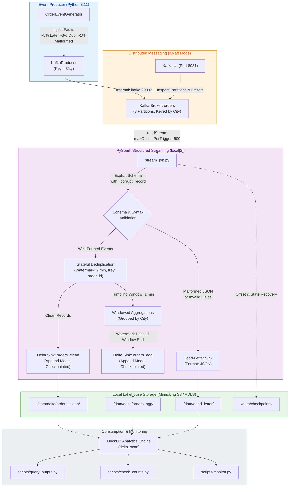
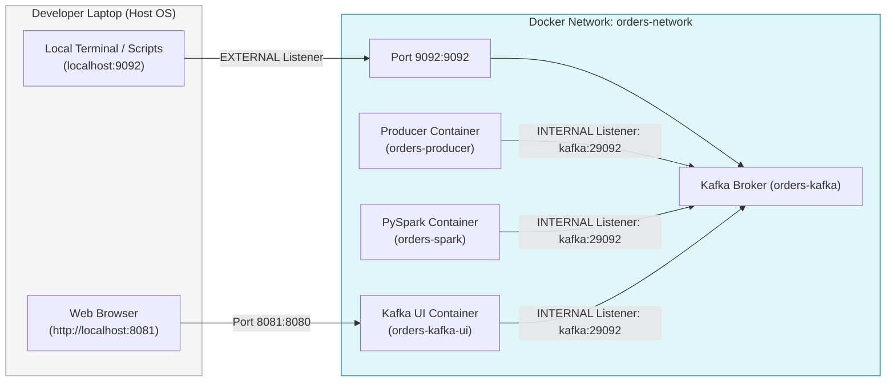

# System Architecture: realtime-orders-streaming

## End-to-End Local Streaming Data Flow

```mermaid
flowchart TD
    subgraph Data_Generation["Event Producer (Python 3.11)"]
        G["OrderEventGenerator"] -->|Inject Faults\n~5% Late, ~3% Dup, ~1% Malformed| P["KafkaProducer\n(Key = City)"]
    end

    subgraph Messaging_Backbone["Distributed Messaging (KRaft Mode)"]
        P -->|Internal: kafka:29092| K["Kafka Broker: orders\n(3 Partitions, Keyed by City)"]
        KUI["Kafka UI (Port 8081)"] -.->|Inspect Partitions & Offsets| K
    end

    subgraph Stream_Engine["PySpark Structured Streaming (local[2])"]
        K -->|readStream\nmaxOffsetsPerTrigger=500| S["stream_job.py"]
        S -->|Explicit Schema\nwith _corrupt_record| SPLIT{"Schema & Syntax\nValidation"}

        SPLIT -->|Malformed JSON\nor Invalid Fields| DLQ["Dead-Letter Sink\n(Format: JSON)"]
        SPLIT -->|Well-Formed Events| DEDUP["Stateful Deduplication\n(Watermark: 2 min, Key: order_id)"]

        DEDUP -->|Clean Records| CLEAN_SINK["Delta Sink: orders_clean\n(Append Mode, Checkpointed)"]
        DEDUP -->|Tumbling Window: 1 min| WIN["Windowed Aggregations\n(Grouped by City)"]
        WIN -->|Watermark Passed Window End| AGG_SINK["Delta Sink: orders_agg\n(Append Mode, Checkpointed)"]
    end

    subgraph Storage_Layer["Local Lakehouse Storage (Mimicking S3 / ADLS)"]
        DLQ --> FS_DLQ["./data/dead_letter/"]
        CLEAN_SINK --> FS_CLEAN["./data/delta/orders_clean/"]
        AGG_SINK --> FS_AGG["./data/delta/orders_agg/"]
        S -.->|Offset & State Recovery| FS_CHK["./data/checkpoints/"]
    end

    subgraph Analytics_Consumption["Consumption & Monitoring"]
        FS_CLEAN -.-> DUCK["DuckDB Analytics Engine\n(delta_scan)"]
        FS_AGG -.-> DUCK
        FS_DLQ -.-> DUCK
        DUCK --> QRY["scripts/query_output.py"]
        DUCK --> CNT["scripts/check_counts.py"]
        DUCK --> MON["scripts/monitor.py"]
    end

    style Data_Generation fill:#E3F2FD,stroke:#1E88E5,color:#0D47A1
    style Messaging_Backbone fill:#FFF3E0,stroke:#FB8C00,color:#E65100
    style Stream_Engine fill:#F3E5F5,stroke:#8E24AA,color:#4A148C
    style Storage_Layer fill:#E8F5E9,stroke:#43A047,color:#1B5E20
    style Analytics_Consumption fill:#ECEFF1,stroke:#546E7A,color:#263238
```

## Kafka Dual Listeners Networking Diagram

```mermaid
flowchart LR
    subgraph Host["Developer Laptop (Host OS)"]
        HOST_CLI["Local Terminal / Scripts\n(localhost:9092)"]
        BROWSER["Web Browser\n(http://localhost:8081)"]
    end

    subgraph Docker_Bridge["Docker Network: orders-network"]
        HOST_CLI -->|EXTERNAL Listener| PORT_9092["Port 9092:9092"]
        PORT_9092 --> BROKER["Kafka Broker (orders-kafka)"]
        
        PRODUCER["Producer Container\n(orders-producer)"] -->|INTERNAL Listener: kafka:29092| BROKER
        SPARK["PySpark Container\n(orders-spark)"] -->|INTERNAL Listener: kafka:29092| BROKER
        
        BROWSER -->|Port 8081:8080| UI["Kafka UI Container\n(orders-kafka-ui)"]
        UI -->|INTERNAL Listener: kafka:29092| BROKER
    end

    style Host fill:#F5F5F5,stroke:#9E9E9E
    style Docker_Bridge fill:#E0F7FA,stroke:#00838F
```
